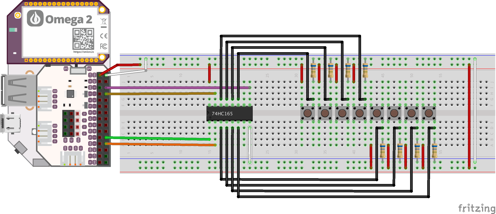

# Onion Omega Parallel-In/Serial-Out Shift Register Driver

A driver to allow the Onion Omega platform to communicate with a PISO shift register in the 74HC165 chipset. This was developed using the Fairchild MM74HC165 chip so make sure to refer to the data sheet for the specific chip you are working with.

## Getting Started

These instructions will get you a copy of the project up and running on your local machine.

### Prerequisites

 - Onion Omega hobby computer with...
	 - Omega Python light installed
	 - Omega GPIO libraries installed
```
# Run from the Onion Omega
> opkg update
> opkg install python-light pyOnionGpio
```
- Wire your Omega up to the PISO shift register. This uses four GPIO pins on the Omega.


**Note** To wire up more than one PISO shift register, connect the same Load/Shift line, Clock Inhibit, and Clock wires to the second shift register. Then connect the Data (Qh) line from the second shift register to the Serial In line of the first register.

### Installing
For now, just grab [pisoDriver.py](pisoDriver.py) and go to town!

## Authors

* **Chris Melnick** - *Initial work* - [melnicorn](https://github.com/melnicorn)

## License

This project is licensed under the MIT License - see the [LICENSE.md](LICENSE.md) file for details **except** [MM74HC165 datasheet](MM74HC165.pdf) which maintains original copyright.

## Acknowledgments

* [Arduino Playground](https://playground.arduino.cc/Code/ShiftRegSN74HC165N/) PISO tutorial and C code
* [MM74HC165](MM74HC165.pdf) Fairchild 74HC165 data sheet
